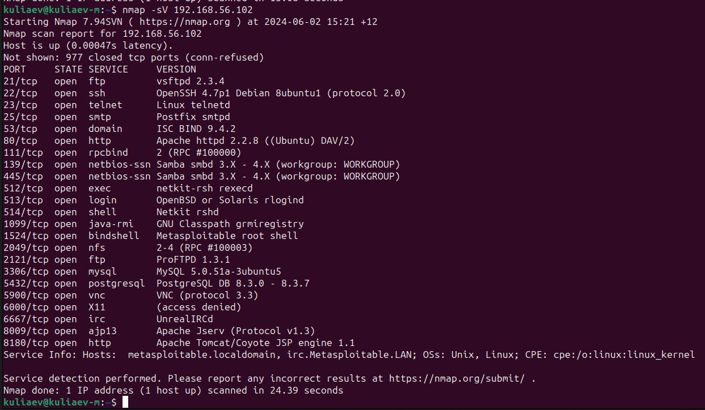
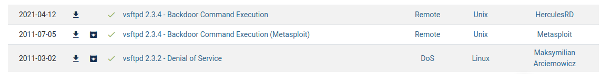
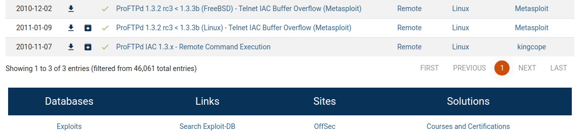
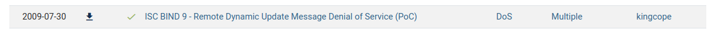

# Домашнее задание к занятию «Уязвимости и атаки на информационные системы» Mikhail Kuliaev

------

### Задание 1

Скачайте и установите виртуальную машину Metasploitable: https://sourceforge.net/projects/metasploitable/.

Это типовая ОС для экспериментов в области информационной безопасности, с которой следует начать при анализе уязвимостей.

Просканируйте эту виртуальную машину, используя **nmap**.

Попробуйте найти уязвимости, которым подвержена эта виртуальная машина.

Сами уязвимости можно поискать на сайте https://www.exploit-db.com/.

Для этого нужно в поиске ввести название сетевой службы, обнаруженной на атакуемой машине, и выбрать подходящие по версии уязвимости.
Ответьте на следующие вопросы:

- Какие сетевые службы в ней разрешены?

- Какие уязвимости были вами обнаружены? (список со ссылками: достаточно трёх уязвимостей)

  

https://www.exploit-db.com/exploits/17491

https://www.exploit-db.com/exploits/16851

https://www.exploit-db.com/exploits/37721

*Приведите ответ в свободной форме.*  

### Задание 2

Проведите сканирование Metasploitable в режимах SYN, FIN, Xmas, UDP.

Запишите сеансы сканирования в Wireshark.

Ответьте на следующие вопросы:

- Чем отличаются эти режимы сканирования с точки зрения сетевого трафика?
- Как отвечает сервер?

SYN - также известное как полуоткрытое сканирование, является самым популярным методом сканирования портов в Nmap. Этот метод использует TCP пакеты типа SYN. Nmap отправляет пакеты SYN на каждый порт, который нужно проверить. Если порт открыт, то удаленный хост отправляет ответное сообщение SYN-ACK. В этом случае, Nmap знает, что порт открыт и записывает его в список открытых портов. Если порт закрыт, то удаленный хост отправляет сообщение RST, а если порт фильтруется (например, брандмауэр блокирует пакеты SYN), то удаленный хост не отправляет никакого ответа. SYN сканирование очень эффективно и быстро определяет открытые порты.

FIN - это сканирование отправляет пакеты TCP с установленным флагом FIN на каждый порт, который нужно проверить. Если порт открыт, то удаленный хост не отправляет ответное сообщение. Если порт закрыт, то удаленный хост отправляет сообщение RST. Если порт фильтруется, то удаленный хост отправляет ICMP сообщение типа Destination Unreachable. FIN сканирование может быть полезным при обнаружении служб, которые реагируют на такие пакеты, например, некоторые Windows системы.

XMAS - это сканирование отправляет пакеты TCP с установленными флагами FIN, PSH и URG на каждый порт, который нужно проверить. Если порт открыт, то удаленный хост не отправляет ответное сообщение. Если порт закрыт, то удаленный хост отправляет сообщение RST. Если порт фильтруется, то удаленный хост отправляет ICMP сообщение типа Destination Unreachable. XMAS сканирование может быть полезным при обнаружении служб, которые реагируют на такие пакеты, например, некоторые Linux системы.

UDP - это сканирование отправляет пакеты UDP на каждый порт, который нужно проверить. Если порт открыт, то удаленный хост не отправляет ответное сообщение. В этом случае, Nmap считает, что порт открыт. Однако, многие хосты настроены таким образом, что не отправляют ответы на закрытые порты, поэтому этот метод может быть медленным и не очень точным. Если порт закрыт или фильтруется, то удаленный хост отправляет ICMP сообщение типа Port Unreachable. UDP сканирование может быть полезным при обнаружении служб, которые используют UDP вместо TCP. Ведь порты могут быть не только TCP.

*Приведите ответ в свободной форме.*
